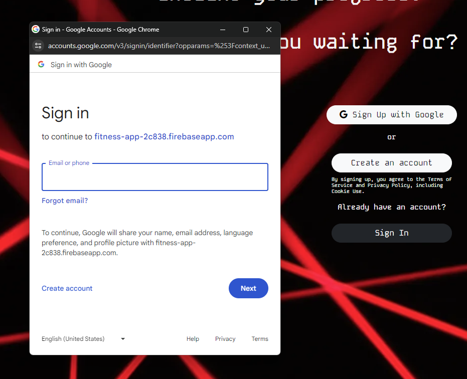

# React Fitness To-Do App

## Overview

This was my module 2 front-end assessment project. The requirements of the project was: 

1. CRUD Operations
2. Basic Authentication (Firebase Login is extra)
3. Use of state management library (React Redux)

## Features

- Landing effect motion when user first visits the page.

- Informational Carousel right beside the login form 

- Firebase Authentication (Google)

- Predictable state management of the workout lists for better user experience
- Accurate minutes-second based timer for tracking a user's workout

- Modal Implementation of editing/creating workout 

- Utility feature (BMI Calculator)

## Installation

1. Clone the repository: `git clone https://github.com/username/repository.git`
2. Navigate to the project directory: `cd repository`
3. Install dependencies: `npm install`
4. Run project: `npm run dev`

## Credit

Thank you to Sigma School for providing me the opportunity to career-switch into the tech field. Exercises/Lessons/Examples were provided by them. https://sigmaschool.co/

## License

MIT License

Copyright (c) [2024] [Daniel McFluffy]

Permission is hereby granted, free of charge, to any person obtaining a copy
of this software and associated documentation files (the "Software"), to deal
in the Software without restriction, including without limitation the rights
to use, copy, modify, merge, publish, distribute, sublicense, and/or sell
copies of the Software, and to permit persons to whom the Software is
furnished to do so, subject to the following conditions:

The above copyright notice and this permission notice shall be included in all
copies or substantial portions of the Software.

THE SOFTWARE IS PROVIDED "AS IS", WITHOUT WARRANTY OF ANY KIND, EXPRESS OR
IMPLIED, INCLUDING BUT NOT LIMITED TO THE WARRANTIES OF MERCHANTABILITY,
FITNESS FOR A PARTICULAR PURPOSE AND NONINFRINGEMENT. IN NO EVENT SHALL THE
AUTHORS OR COPYRIGHT HOLDERS BE LIABLE FOR ANY CLAIM, DAMAGES OR OTHER
LIABILITY, WHETHER IN AN ACTION OF CONTRACT, TORT OR OTHERWISE, ARISING FROM,
OUT OF OR IN CONNECTION WITH THE SOFTWARE OR THE USE OR OTHER DEALINGS IN THE
SOFTWARE.